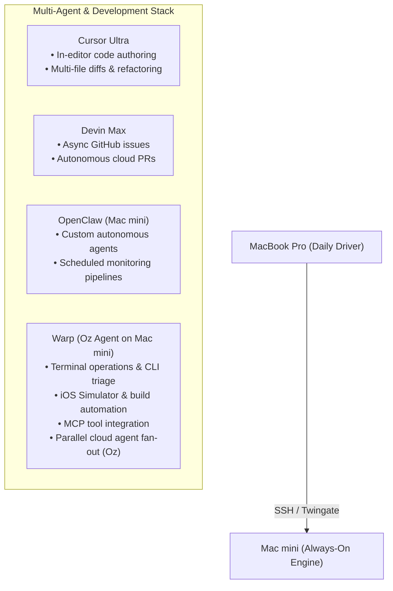

# Mac mini Stack & Warp Environment Manager

This repository contains custom Warp workflows, automation scripts, and tab configurations for managing local processes, repositories, iOS simulators, and autonomous agent instances on the remote Mac mini.

---

## Tooling Roles & Stack Architecture



| Tool | Primary Role in Stack |
| :--- | :--- |
| **Warp (Oz Agent)** | **Terminal operations, iOS simulator automation, local CLI troubleshooting, MCP integrations, and dispatching parallel cloud agents.** |
| **Cursor Ultra** | In-editor code authoring, multi-file refactoring, inline diffs, and fast feature coding. |
| **Devin Max** | Complex, long-running asynchronous GitHub issues and autonomous PR creation. |
| **OpenClaw (Mac mini)** | Self-hosted agent tasks, background pipelines, and local agent orchestration. |
| **Claude / ChatGPT / Grok** | High-level architectural reasoning, strategic design, and conversational consulting. |

---

## Workflows & Scripts

### 1. `~/.warp/scripts/macmini_env.sh`
Central Bash script managing local daemons, simulators, and multi-repo state.

* **Usage:**
  ```bash
  ~/.warp/scripts/macmini_env.sh [action] [param2] [param3]
  ```

* **Available Actions:**
  * `health` / `status`: Full status check across OpenClaw gateway, booted iOS simulators, research-os coverage/FMP status, AlphaOS dev ports, and system metrics.
  * `start` / `up`: Boots target iOS simulator headless (or with GUI) and ensures OpenClaw gateway is running.
  * `stop` / `down`: Shuts down iOS simulators and stops OpenClaw daemon.
  * `restart`: Clean restart of OpenClaw and simulator environment.
  * `repos:sync`: Synchronizes all active repositories (`research-os`, `AlphaOS`, `rendezvous-unified-mvp`, `ai-brain`) via `git fetch --prune` and `git pull --rebase`.
  * `repos:status`: Summarizes active branch and dirty status across all active repos.
  * `research`: Inspects the `research-os` active coverage registry and FMP environment.
  * `alphaos`: Verifies if AlphaOS FastAPI backend (`:8000`) and Expo Metro (`:8081`) are active.

### 2. Warp Workflows (`~/.warp/workflows/`)
Surfaced automatically in the Warp Command Palette (`Cmd+P` / `Ctrl+Shift+R`):
* **`macmini-env-manager.yaml`** ("Mac mini Stack & Environment Manager"): Full lifecycle, health check, repository sync, and service control.
* **`rendezvous-validate.yaml`** ("Rendezvous Validation Gate"): Runs pre-PR verification gates (`mobile:validate`, `web:validate`, `validate`, `shared:typecheck`, `parity:verify`).
* **`research-os-ops.yaml`** ("Research OS Operations"): Runs Linear coverage bootstrapping (`scripts/bootstrap_linear_coverage.py`), decision memo audits (`scripts/audit_memo.py`), and dashboard summaries.
* **`alphaos-stack.yaml`** ("AlphaOS Development Stack"): Launches AlphaOS dev commands (`dev`, `dev:agent`, `dev:mobile`, `ci:local`).
* **`ios-simctl-tools.yaml`** ("iOS Simulator Controls"): Quick commands for booting, screenshots, shutdown, and device inspection.

---

## Tab Configurations (`~/.warp/tab_configs/`)

Instantly open customized multi-pane workspaces from Warp's `+` tab menu:
* **`rendezvous_workspace.toml` ("Rendezvous Workspace"):**
  * Left pane: Expo Mobile terminal (`apps/mobile`)
  * Top-right pane: Mobile Netlify functions runner (`:9999`)
  * Bottom-right pane: Oz Agent terminal for rapid CLI fixes and gates
* **`research_alphaos_workspace.toml` ("Research & AlphaOS Workspace"):**
  * Left pane: Research OS terminal (models & memo workflow)
  * Top-right pane: AlphaOS FastAPI Agent backend (`:8000`)
  * Bottom-right pane: AlphaOS Expo mobile runner
* **`agent_control_center.toml` ("Agent Control Center"):**
  * Left pane: OpenClaw live gateway status & monitoring
  * Right pane: Warp Oz Agent terminal for autonomous tasks
