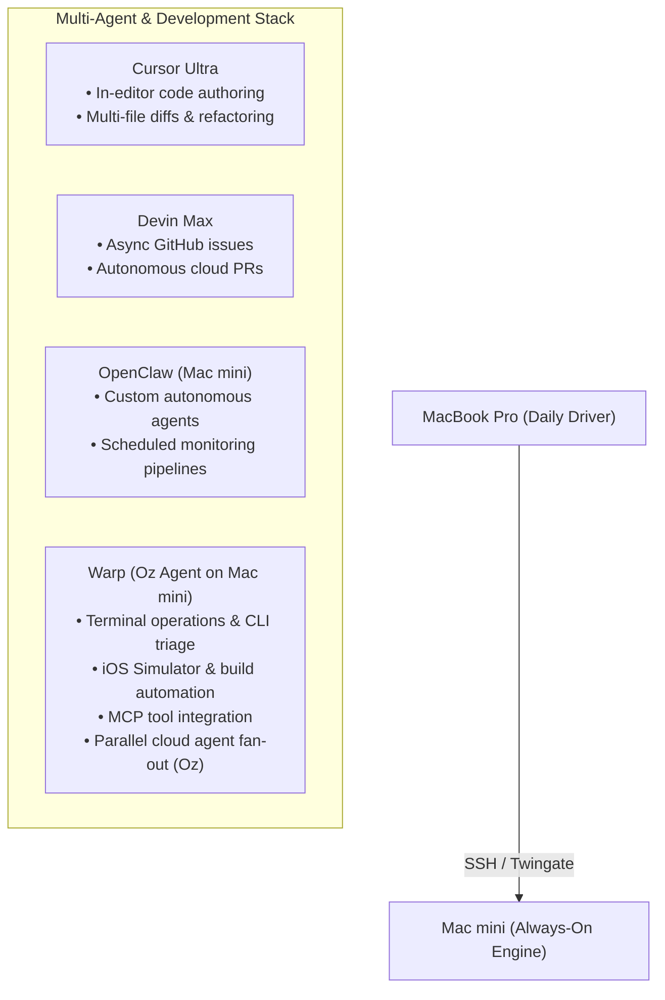

# Mac mini Stack & Warp Environment Manager

This repository contains custom Warp workflows, automation scripts, CLI shortcuts, and tab configurations for managing multi-repo workflows, iOS simulators, autonomous agents, and executive status dashboards across macOS machines (e.g. MacBook Pro and Mac mini).

---

## 🚀 Quick Install on Another Machine (e.g., MacBook Pro)

Follow these steps on any new machine or secondary Mac to sync the exact same Warp workflows, dashboard, and scripts:

### Step 1: Clone into `~/.warp`
If `~/.warp` does not exist yet:
```bash
git clone https://github.com/sree-akkineni/warp-config.git ~/.warp
```

If `~/.warp` already exists on your machine, initialize it as a remote tracking branch:
```bash
cd ~/.warp
git init -b main
git remote add origin https://github.com/sree-akkineni/warp-config.git
git fetch origin main
git reset --hard origin/main
git branch --set-upstream-to=origin/main main
```

### Step 2: Hook up CLI Shortcuts & PATH
Add the Warp initialization script to your `~/.zshrc`:
```bash
echo '[[ -f ~/.warp/init.sh ]] && source ~/.warp/init.sh' >> ~/.zshrc
source ~/.zshrc
```

This automatically enables:
* `dashboard` → Runs the executive status dashboard.
* `macmini` → Runs the host and environment manager script.
* `build` → Triggers remote builds/gates and sends notifications.
* `deploy-sim` → Installs and launches the latest build onto an iOS simulator.
* `screenshot-sim` → Captures an iOS simulator screenshot and exports it for remote review.
* Adds `~/.warp/bin` to your system `PATH`.

---

## 🖥️ Recommended Desktop Setup: The "Zero-Clutter" HUD

To prevent Warp from competing with Cursor, Devin, Claude, and your browser for screen space, configure Warp as an invisible dropdown Heads-Up Display:

1. In Warp, open **Settings (`Cmd + ,`)** → **Features** → **Window**.
2. Enable **Hotkey Window** and set the shortcut to `Option + Space` (or `Ctrl + ~`).
3. Whenever you need to sync repos, inspect agents, or run tests:
   * Press `Option + Space` (Warp drops down).
   * Run your command or workflow.
   * Press `Option + Space` (Warp disappears instantly).

---

## 🛠️ Tooling Roles in the Multi-Agent Stack



| Tool | Primary Role in Stack |
| :--- | :--- |
| **Warp (Oz Agent)** | **Terminal operations, iOS simulator automation, local CLI troubleshooting, MCP integrations, and dispatching parallel cloud agents.** |
| **Cursor Ultra** | In-editor code authoring, multi-file refactoring, inline diffs, and fast feature coding. |
| **Devin Max** | Complex, long-running asynchronous GitHub issues and autonomous PR creation. |
| **OpenClaw (Mac mini)** | Self-hosted agent tasks, background pipelines, and local agent orchestration. |
| **Claude / ChatGPT / Grok** | High-level architectural reasoning, strategic design, and conversational consulting. |

---

## ⚡ Daily Usage Guide

### 1. The Summary Dashboard
Run anytime to see a real-time status rollup of active agent daemons, GitHub repositories/PRs, and Linear issues:
```bash
dashboard
# or
~/.warp/scripts/summary_dashboard.sh
```
* **Warp Shortcut:** Press `Ctrl + Shift + R` → select **"Multi-Agent & Stack Summary Dashboard"**.

### 2. The Stack & Environment Manager
```bash
macmini [action] [param2] [param3]
# or
~/.warp/scripts/macmini_env.sh [action]
```

* **Available Actions:**
  * `health` / `status`: Full status check across OpenClaw gateway, booted iOS simulators, research-os coverage/FMP status, AlphaOS dev ports, and system metrics.
  * `repos:sync`: Synchronizes all active repositories (`research-os`, `AlphaOS`, `rendezvous-unified-mvp`, `ai-brain`) via `git fetch --prune` and `git pull --rebase`.
  * `repos:status`: Summarizes active branch and dirty status across all active repos.
  * `start` / `up`: Boots target iOS simulator headless (or with GUI) and ensures OpenClaw gateway is running.
  * `stop` / `down`: Shuts down iOS simulators and stops OpenClaw daemon.
  * `restart`: Clean restart of OpenClaw and simulator environment.
  * `research`: Inspects the `research-os` active coverage registry and FMP environment.
  * `alphaos`: Verifies if AlphaOS FastAPI backend (`:8000`) and Expo Metro (`:8081`) are active.
### 3. Remote Build & Validation Runner
Offload heavy tests, linter runs, or verification gates to the Mac mini:
```bash
build [project] [task] [notify:true|false]
# Example:
build rendezvous shared:typecheck
build rendezvous mobile:validate
build alphaos ci:local
build research-os scorecard
```
* **Warp Shortcut:** Press `Ctrl + Shift + R` → select **"Trigger Remote Build & Verification"**.

### 4. iOS Simulator Automated Deployer
Deploy the latest compiled build and launch the app in one command:
```bash
deploy-sim [app] [simulator_name] [open_gui:true|false]
# Example:
deploy-sim rendezvous booted true
deploy-sim alphaos "iPhone 17 Pro" true
```
* **Warp Shortcut:** Press `Ctrl + Shift + R` → select **"Deploy to iOS Simulator & Launch"**.

### 5. Simulator Screenshot Exporter for Remote Review
Capture an iOS simulator screenshot with an audit label and export to the shared folder:
```bash
screenshot-sim [label] [simulator_name] [custom_folder]
# Example:
screenshot-sim login-screen
screenshot-sim whisper-feed booted
screenshot-sim bug-repro booted /custom/path
```
* Always keeps a pointer to `~/.warp/screenshots/latest.png` for fast inspection.
* Automatically sends the screenshot to your Telegram if configured.
* **Warp Shortcut:** Press `Ctrl + Shift + R` → select **"Capture Simulator Screenshot for Review"**.

---

## 📱 Mobile Operations (iPhone via Termius & Telegram)

### 1. Termius (1-Tap Command Center)
Configure Termius on your iPhone to connect to your Mac mini over Twingate:
* **Host:** Your Mac mini local IP or hostname (`Akkineni-Mac-Mini.local`)
* **Username:** `sakki`
* **Create Termius Snippets (1-tap buttons):**
  * `dashboard` → Live overview of PRs, Linear tasks, and agents.
  * `macmini repos:sync` → Pulls all 5 repositories.
  * `screenshot-sim quick-check` → Captures active simulator screen.
  * `deploy-sim rendezvous booted true` → Installs and opens Rendezvous.

### 2. Telegram Bot Alerts & Photos
To receive push notifications and screenshot images directly to your phone:
1. Message **@BotFather** on Telegram: send `/newbot` to get your `TELEGRAM_BOT_TOKEN`.
2. Message **@userinfobot** on Telegram to get your numeric `TELEGRAM_CHAT_ID`.
3. Create `~/.warp/telegram.env` on your Mac mini:
   ```bash
   TELEGRAM_BOT_TOKEN="your_bot_token"
   TELEGRAM_CHAT_ID="your_numeric_chat_id"
   ```
4. Once set, every `screenshot-sim` call automatically pushes the screenshot photo to your Telegram chat, and `build` sends success/failure alerts.

---

## 📑 Workflows Reference (`~/.warp/workflows/`)

Warp automatically indexes these YAML files into the Command Search (`Ctrl + Shift + R`):

* **`capture-simulator-screenshot.yaml`** ("Capture Simulator Screenshot for Review"): Captures full-res PNG from simulator, saves with timestamp and label to `~/.warp/screenshots/`, and updates `latest.png`.
* **`deploy-ios-simulator.yaml`** ("Deploy to iOS Simulator & Launch"): Auto-detects latest `.app` build in DerivedData, installs to simulator, launches bundle, and displays GUI.
* **`remote-build.yaml`** ("Trigger Remote Build & Verification"): Offload builds and validation suites to the Mac mini with macOS completion notifications.
* **`summary-dashboard.yaml`** ("Multi-Agent & Stack Summary Dashboard"): Live executive view of active agent processes (OpenClaw, Grok, Simulators), GitHub repos/PRs (across `Sidecar-Tools` & `sree-akkineni`), and active Linear issues.
* **`macmini-env-manager.yaml`** ("Mac mini Stack & Environment Manager"): Full lifecycle, health check, repository sync, and service control.
* **`rendezvous-validate.yaml`** ("Rendezvous Validation Gate"): Runs pre-PR verification gates (`mobile:validate`, `web:validate`, `validate`, `shared:typecheck`, `parity:verify`).
* **`research-os-ops.yaml`** ("Research OS Operations"): Runs Linear coverage bootstrapping (`scripts/bootstrap_linear_coverage.py`), decision memo audits (`scripts/audit_memo.py`), and dashboard summaries.
* **`alphaos-stack.yaml`** ("AlphaOS Development Stack"): Launches AlphaOS dev commands (`dev`, `dev:agent`, `dev:mobile`, `ci:local`).
* **`ios-simctl-tools.yaml`** ("iOS Simulator Controls"): Quick commands for booting, screenshots, shutdown, and device inspection.

---

## Tab Configurations (`~/.warp/tab_configs/`)

Instantly open customized multi-pane workspaces from Warp's `+` tab menu:
* **`rendezvous_workspace.toml` ("Rendezvous Workspace"):**
  * Left pane: Expo Mobile terminal (`apps/mobile`)
  * Top-right pane: Mobile Netlify functions runner (`:9999`)
  * Bottom-right pane: Oz Agent terminal for rapid CLI fixes and gates
* **`research_alphaos_workspace.toml` ("Research & AlphaOS Workspace"):**
  * Left pane: Research OS terminal (models & memo workflow)
  * Top-right pane: AlphaOS FastAPI Agent backend (`:8000`)
  * Bottom-right pane: AlphaOS Expo mobile runner
* **`agent_control_center.toml` ("Agent Control Center"):**
  * Left pane: OpenClaw live gateway status & monitoring
  * Right pane: Warp Oz Agent terminal for autonomous tasks
